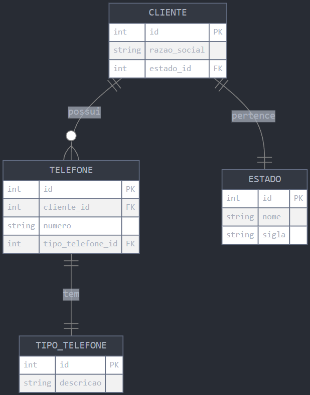

<p align="center">
  
</p>

<h1 align="center">Desafio técnico</h1>


## 1) Observe o trecho de código:

int INDICE = 12, SOMA = 0, K = 1;

enquanto K < INDICE faça

{ K = K + 1; SOMA = SOMA + K;}

imprimir(SOMA);


**Ao final do processamento, qual será o valor da variável SOMA?**

<h3>Resposta: 77</h3>

[Link para arquivo](./src/questoes/questao1.somaResultado.js)

``` JS
const soma = () => {
  let indice = 12;
  let soma = 0;
  let k = 1;

  while (k < indice) {
    k = k + 1;
    soma = soma + k;
  }

  console.log(`Soma: ${soma}`)
}

soma()
```
## 2) Descubra a lógica e complete o próximo elemento:
a) 1, 3, 5, 7, __

b) 2, 4, 8, 16, 32, 64, __

c) 0, 1, 4, 9, 16, 25, 36, __

d) 4, 16, 36, 64, __

e) 1, 1, 2, 3, 5, 8, __

f) 2,10, 12, 16, 17, 18, 19, __


<h3>Resposta: </h3>

[Link para arquivo](./src/questoes/questao2.completeSequencia.js)

a) Próximo elemento: <strong>9</strong>. Lógica: A sequência aumenta de 2 em 2. <br/> <br/>
b) Próximo elemento: <strong>128</strong>. Lógica: Cada número é o dobro do anterior (multiplicação por 2). <br/> <br/>
c) Próximo elemento: <strong>49</strong>. Lógica: Os números são quadrados perfeitos. <br/> <br/>
d) Próximo elemento: <strong>100</strong>. Lógica: Os números são quadrados de números pares. <br/> <br/>
e) Próximo elemento: <strong>13</strong>. Lógica: Segue a sequência de Fibonacci. <br/> <br/>
e) Próximo elemento: <strong>20</strong>. Lógica: Os pares são somados e os ímpares são incrementados. <br/> <br/>

``` JS
const sequenciaA = [1, 3, 5, 7];
const sequenciaB = [2, 4, 8, 16, 32, 64];
const sequenciaC = [0, 1, 4, 9, 16, 25, 36];
const sequenciaD = [4, 16, 36, 64];
const sequenciaE = [1, 1, 2, 3, 5, 8];
const sequenciaF = [2, 10, 12, 16, 17, 18, 19];

const ultimoElemento = (seq) => seq.at(-1);

const proximoA = (seq) => {
    return ultimoElemento(seq) + 2;
}

const proximoB = (seq) =>  {
    return ultimoElemento(seq) * 2;
}

const proximoC = (seq) =>  {
    return Math.pow(Math.sqrt(ultimoElemento(seq)) + 1, 2);
}

const proximoD = (seq) =>  {
    return Math.pow(Math.sqrt(ultimoElemento(seq)) + 2, 2);
}

const proximoE = (seq) =>  {
    return ultimoElemento(seq) + seq[seq.length - 2];
}

const proximoF = (seq) =>  {
    const ultimo = ultimoElemento(seq);
    return ultimo % 2 === 0 ? ultimo + 4 : ultimo + 1
}

const encontrarProximoElemento = (seq, funcaoProximo) => {
    seq.push(funcaoProximo(seq));
    return seq.at(-1);
}

console.log("Próximo elemento A:", encontrarProximoElemento(sequenciaA, proximoA));
console.log("Próximo elemento B:", encontrarProximoElemento(sequenciaB, proximoB));
console.log("Próximo elemento C:", encontrarProximoElemento(sequenciaC, proximoC));
console.log("Próximo elemento D:", encontrarProximoElemento(sequenciaD, proximoD));
console.log("Próximo elemento E:", encontrarProximoElemento(sequenciaE, proximoE));
console.log("Próximo elemento F:", encontrarProximoElemento(sequenciaF, proximoF));
```

## 3) Dado um vetor que guarda o valor de faturamento diário de uma distribuidora de todos os dias de um ano, faça um programa, na linguagem que desejar, que calcule e retorne:
- O menor valor de faturamento ocorrido em um dia do ano;
- O maior valor de faturamento ocorrido em um dia do ano;
- Número de dias no ano em que o valor de faturamento diário foi superior à média anual.

a) Considerar o vetor já carregado com as informações de valor de faturamento.

b) Podem existir dias sem faturamento, como nos finais de semana e feriados. Estes dias devem ser ignorados no cálculo da média.

c) Utilize o algoritmo mais veloz que puder definir.

<h3>Resposta: </h3>

[Link para arquivo](./src/questoes/questao3.faturamentoDiario.js)

``` JS
const qtdVendasPorDiaNoAno = Array.from({length: 365}, (_, index) => 
  (index % 7 === 0) ? 0 : Number((Math.random() * 30000).toFixed(2)));

const { diasComVendas, menor, maior, soma, totalDias } = qtdVendasPorDiaNoAno.reduce((acc, venda, index) => {
  if (venda > 0) {
    acc.diasComVendas.push(venda);
    acc.menor = Math.min(acc.menor, venda);
    acc.maior = Math.max(acc.maior, venda);
    acc.soma += venda;
  }
  acc.totalDias++;
  return acc;
}, { diasComVendas: [], menor: Infinity, maior: -Infinity, soma: 0, totalDias: 0 });


const diasAcimaDaMedia = () => {
  const media = soma / diasComVendas.length;
  return diasComVendas.filter(valor => valor > media).length;
};

const formatarValorParaBRL = (valor) => {
  return new Intl.NumberFormat('pt-BR', { style: 'currency', currency: 'BRL' }).format(
    valor,
  )
}

console.log(`O menor valor de faturamento ocorrido em um dia do ano foi: ${formatarValorParaBRL(menor)}`);
console.log(`O maior valor de faturamento ocorrido em um dia do ano foi: ${formatarValorParaBRL(maior)}`);
console.log(`Número de dias em que o faturamento diário foi superior à média anual: ${diasAcimaDaMedia()}`);
```

## 4) Banco de dados
Uma empresa solicitou a você um aplicativo para manutenção de um cadastro de clientes. Após a reunião de definição dos requisitos, as conclusões foram as seguintes:
- Um cliente pode ter um número ilimitado de telefones;
- Cada telefone de cliente tem um tipo, por exemplo: comercial, residencial, celular, etc. O sistema deve permitir cadastrar novos tipos de telefone;
- A princípio, é necessário saber apenas em qual estado brasileiro cada cliente se encontra. O sistema deve permitir cadastrar novos estados;

Você ficou responsável pela parte da estrutura de banco de dados que será usada pelo aplicativo. Assim sendo:
- Proponha um modelo lógico para o banco de dados que vai atender a aplicação. Desenhe as tabelas necessárias, os campos de cada uma e marque com setas os relacionamentos existentes entre as tabelas;
- Aponte os campos que são chave primária (PK) e chave estrangeira (FK);
- Faça uma busca utilizando comando SQL que traga o código, a razão social e o(s) telefone(s) de todos os clientes do estado de São Paulo (código “SP”);

<h3>Resposta: </h3>

[Link para arquivo](./src/questoes/questao4.bancoDeDados.sql)


<!--  -->

<br/>

``` SQL
SELECT 
  c.id AS codigo, 
  c.razao_social, 
  t.numero AS telefone
FROM CLIENTE c
JOIN ESTADO e ON c.estado_id = e.id
LEFT JOIN TELEFONE t ON c.id = t.cliente_id
WHERE e.sigla = 'SP'
ORDER BY c.razao_social, t.numero;
```

## 5) Dois veículos, um carro e um caminhão, saem respectivamente de cidades opostas pela mesma rodovia. O carro, de Ribeirão Preto em direção a Barretos, a uma velocidade constante de 90 km/h, e o caminhão, de Barretos em direção a Ribeirão Preto, a uma velocidade constante de 80 km/h. Quando eles se cruzarem no percurso, qual estará mais próximo da cidade de Ribeirão Preto?

a) Considerar a distância de 125km entre a cidade de Ribeirão Preto <-> Barretos. <br/><br/>
b) Considerar 3 pedágios como obstáculo e que o carro leva 5 minutos a mais para passar em cada um deles, pois ele não possui dispositivo de cobrança de pedágio.<br/><br/>
c) Explique como chegou no resultado.

<h3>Resposta: <strong>ambos estarão a mesma distância de Ribeirão Preto</strong></h3>

[Link para arquivo](./src/questoes/questao5.Veiculos.md)

## Cálculo do Tempo até o Encontro

<h3>1. Carro</h3>
O carro viaja a 90 quilômetros por hora. Para percorrer 125 quilômetros, ele levaria aproximadamente uma hora e 23 minutos. No entanto, como ele enfrenta os pedágios, adicionamos mais 15 minutos ao seu tempo total. Portanto, o carro levará cerca de uma hora e 38 minutos para chegar a Barretos.


<h3>2. Caminhão</h3>
O caminhão viaja a 80 quilômetros por hora. Para percorrer 125 quilômetros, ele levaria aproximadamente uma hora e 34 minutos.

## O Encontro
<h3>3. Velocidade Combinada</h3>
Agora somamos as velocidades dos dois veículos. Juntos, eles estão se aproximando um do outro à velocidade total de 170 quilômetros por hora. Com essa velocidade combinada, podemos calcular o tempo que levarão para se encontrar ao percorrerem juntos os 125 quilômetros que os separam. Esse tempo é aproximadamente 44 minutos.

## Distâncias Percorridas até o Encontro


<h3>4. Carro</h3>
Durante os aproximadamente 44 minutos até o encontro, o carro percorre cerca de 66 quilômetros.


<h3>5. Caminhão</h3>
Durante o mesmo período de aproximadamente 44 minutos, o caminhão percorre cerca de 59 quilômetros.

## Distância até Ribeirão Preto no Momento do Encontro


<h3>6. Carro</h3>
O carro, que percorreu cerca de 66 quilômetros em direção a Barretos, terá ainda cerca de 59 quilômetros restantes até Ribeirão Preto.


<h3>7. Caminhão</h3>
O caminhão, que percorreu cerca de 59 quilômetros em direção a Ribeirão Preto, estará exatamente a essa mesma distância de Ribeirão Preto.

## Conclusão
Portanto, quando os veículos se cruzarem na rodovia, ambos estarão a aproximadamente 59 quilômetros de Ribeirão Preto, nenhum deles está mais próximo da cidade em questão.